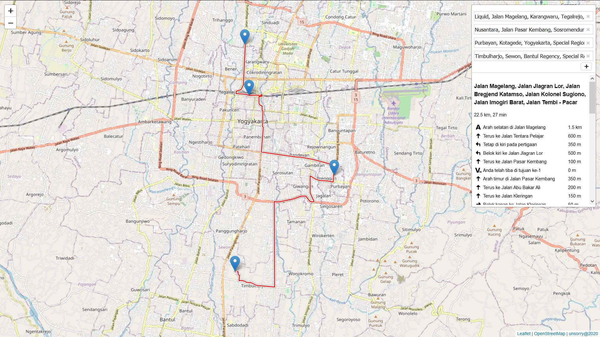

# Install-OSRM-Server-di-Ubuntu
##

**Memperbarui daftar package pada ubuntu**
```
sudo apt-get update
```

**Memperbarui package pada ubuntu**
```
sudo apt-get upgrade
```

**Memasang Dependensi**
```
sudo apt install build-essential git cmake pkg-config \
libbz2-dev libxml2-dev libzip-dev libboost-all-dev \
lua5.2 liblua5.2-dev libtbb-dev
```

**Buat direktori/folder khusus untuk OSRM**
```
mkdir osrm
```

**Masuk ke dalam direktori/folder khusus untuk OSRM**
```
cd osrm
```

**Mendapatkan OSRM dari GitHub repository official**
```
git clone https://github.com/Project-OSRM/osrm-backend.git
```

**Masuk ke dalam direktori/folder osrm-backend**
```
cd osrm-backend
```

**Buat direktori/folder build di dalam direktori/folder osrm-backend**
```
mkdir -p build
```

**Masuk ke dalam direktori/folder build**
```
cd build
```

**Kompilasi dan memasang binari OSRM**
```
cmake ..
cmake --build .
sudo cmake --build . --target install
```

**Kembali ke direktori/folder osrm**
```
cd ~/osrm
```

**Konfigurasi STXXL dengan file .stxxl pada direktori/folder osrm**
```
vi .stxxl
```

**Di dalam file stxxl tuliskan seperti ini**
```
disk=/tmp/stxxl,10G,syscall
```
*Simpan dan tutup file stxxl tersebut*

##
**Buat link untuk profil kecepatan pada direktori/folder osrm**
```
ln -s osrm-backend/profiles/car.lua profile.lua
ln -s osrm-backend/profiles/lib
```

**Unduh Data OpenStreetMap untuk Wilayah Indonesia**
```
wget https://download.geofabrik.de/asia/indonesia-latest.osm.bz2
```

**Ekstrak OpenStreetMap Data menjadi format osm**
```
bzip2 -d indonesia-latest.osm.bz2
```
> *Catatan: OpenStreetMap untuk Wilayah Indonesia ketika diekstrak menjadi format osm akan memiliki ukuran hampir 50GB
Sehingga apabila hanya akan digunakan untuk wilayah tertentu, Anda dapat mengunduh data openstreetmap menggunakan QGIS Desktop menggunakan plugin OSM Downloader.*

##
**Ekstrak profil mobil dari Data OpenStreetMap**
```
osrm-extract indonesia-latest.osm -p ./osrm-backend/profiles/car.lua
```

**Membangun Hirarki**
```
osrm-contract indonesia-latest.osrm
```

##
**Menjalankan OSRM Server**
```
tmux
```

**Menjalankan routing engine server HTTP pada port 5000 di dalam sesi tmux**
```
osrm-routed indonesia-latest.osrm
```

**Keluar dari sesi tmux**
```
tekan tombol CTRL+B kemudian tekan tombol D
```

##
**Tes OSRM**
```
http://localhost:5000/route/v1/driving/110.3640550,-7.7892559;110.3596083,-7.8100845?steps=true&alternatives=false
```
> *Ubah localhost menjadi ipaddress/domain dari server yang digunakan*

**Contoh OSRM di LeafletJS**



##
*Sudah dicoba dan berjalan baik di ubuntu 16 dan ubuntu 18*

Sumber:
- [https://github.com/Project-OSRM/osrm-backend](https://github.com/Project-OSRM/osrm-backend)

- [https://benjaminberhault.com/post/2018/12/08/set-up-an-osrm-server-on-ubuntu.html](https://benjaminberhault.com/post/2018/12/08/set-up-an-osrm-server-on-ubuntu.html)

